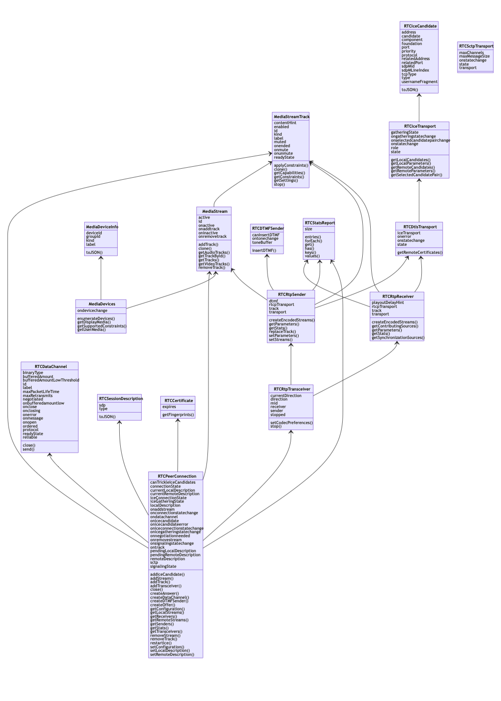

# webrtc-api-graph
Display a graph representing the WebRTC JavaScript Object models and relations.

## Install

Serve the two files `webrtc-api.html` and `webrtc-api.js` by your web server (NodeJS or any).

## Usage

Once loaded, the page will inspect the WebRTC API implemented by the browser used.

Click on the button **Save** to export an image of the model.

## Early-version

This is a dirty and early version. Don't hesitate to propose enhancements.

## Third party tools used

[**Mermaid**](https://mermaid-js.github.io/mermaid/#/) is used to generate the graph.